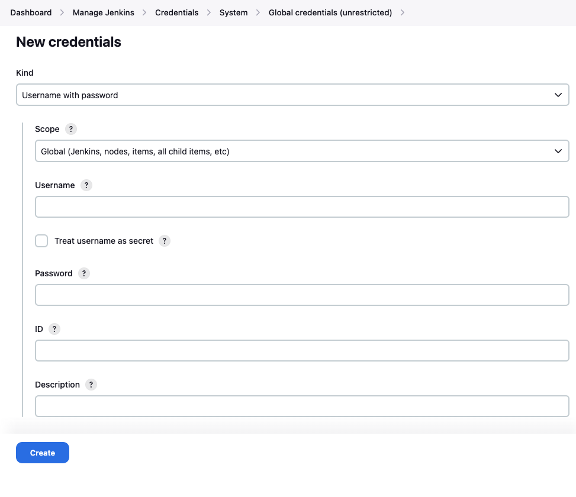
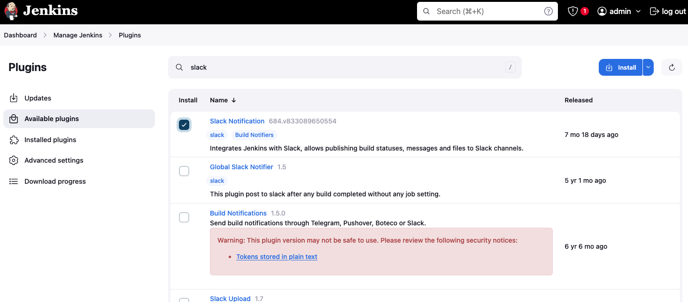

# ce-team-final-project

## Terraform - AWS EKS

- Apply the terraform code to provision an Elastic Kubernetes Server on AWS.
- The output will instruct you how to point your kubectl to the EKS

## ArgoCD installation

Once kubectl is correctly pointed to our EKS Cluster, we can install ArgoCD

Create a namespace for our CI/CD application ```kubectl create namespace argocd```

Install ArgoCD ```kubectl apply -n argocd -f https://raw.githubusercontent.com/argoproj/argo-cd/stable/manifests/install.yaml```

- Get the ArgoCD Password ```kubectl -n argocd get secret argocd-initial-admin-secret -o jsonpath="{.data.password}" | base64 -d```
- Port Forward the ArgoCD deployment to localhost ```kubectl port-forward svc/argocd-server -n argocd 3000:443```
- visit [localhost:3000](http://localhost:3000)
  - alternatively, if configured correctly, ```kubectl cluster-info -n argocd``` should return the public address of the control plane, which will have ArgoCD available on port 443
- username is admin
- password is obtained from the earlier step

## CircleCI Image Build & Push

The .circleci directory includes the instructions for CircleCI to follow when a new build of the frontend or backend images is required.

This config file is run as a job every time a change occurs in the repo, but it looks specifically for changes to either of the frontend or backend app directories, and only runs a build job when necessary.

The config file currently pushes images to an AWS public Elastic Container Registry - the registry can be amended to your preference.

- Log into CircleCI
- Follow their instructions for setting up access to the repo
- Create a new project for the apps (one project covers both apps)
- Point the project to the repo
- CircleCI will read the config file and will build and push the images

## Launch the Frontend App via ArgoCD

Once logged into ArgoCD we can deploy our app

- Link the GitHub repo to ArgoCD (we recommend using a personal access token)
- (follow these instructions for each of the frontend and backend apps)
  - '+ New App'  
    - GENERAL
      - provide an app name
      - project name (default)
    - SOURCE
      - repository URL (if added correctly in earlier step then this will be available from a dropdown menu)
      - path (folder that contains your yaml files)
    - DESTINATION
      - Cluster URL (choose from the dropdown list)
      - Namespace (default)
  - Sync the app

## Visit the Frontend App

Use the command ```kubectl describe svc/frontend-service | grep "LoadBalancer Ingress"```  to get the URL for the app
(ensure that you use HTTP:// and not HTTPS://)

> ## Jenkins Approach (WIP):
> 
> ### Jenkins CICD Install via Helm
> 
> Once kubectl is correctly pointed to our EKS Cluster, we can install Jenkins using helm
> 
> Create a namespace for our CI/CD application ```kubectl create namespace cicd```
> 
> Install Jenkins ```helm install jenkins jenkins-helm/ -n cicd```
> 
> - Port Forward the jenkins deployment to localhost ```kubectl port-forward -n cicd svc/jenkins-service 3000:3000```
> - visit [localhost:3000](http://localhost:3000)
> 
> - If this is first-time setup then the admin password needs to be retrieved from the logs of the pod that jenkins was installed on
> ```kubectl logs -n cicd -l app=jenkins-server --tail 25```
> ### Jenkins DockerHub credentials configuration
> 
> - In the Jenkins Dashboard, go to -> Manage Jenkins -> Manage Credentials -> Stored scoped to jenkins -> global -> Add Credentials
> 
> - Add a new credential under "Global credentials"
> - Choose "Username with password" type, enter your Docker Hub username and password, and assign an ID of ``` dockerhub``` to this credential
> 
> 
> 
> - You can now securely access your Docker Hub credentials in the Jenkins pipeline
> 
> 
> ### JenkinsFile FrontEnd Configuration (CI/CD)
> 
> Configure the Jenkinsfile.groovy to point to your FrontEnd GitHub repository:
> 
> #### If your repository is private:
> 
> - Set up a Jenkins credential for accessing the private repository: 
> 
>   - Go to the Jenkins Dashboard and create a new "Username with password" credential.
>   
>   - Enter your GitHub username and Personal Access Token as the password.
>   
>   - Assign an ID of `github-repo` to this credential.
>   
>   - Replace line 20 of the frontend/Jenkinsfile.groovy with your GitHub link for the repository.
> 
> #### If your repository is public:
> 
> - Since your repository is public, you won't need any credentials to access it. 
> 
> - In your Jenkinsfile located in the frontend directory, replace the following line 12 with the appropriate link to your public GitHub repository, and delete ```credentialsId: 'github-repo'``` from line 21.
>   
> 
> ## Jenkins Slack functionality configuration
> First, you need to install the Slack Notifications Plugin in Jenkins:
> - Go to your Jenkins dashboard.
> - Navigate to "Manage Jenkins" > "Manage Plugins".
> - In the "Available" tab, search for "Slack Notification Plugin".
> - Install the plugin and restart Jenkins if required.
> 
> 
> 
> Configure Slack Integration:
> - After installing the Slack Notification Plugin, go to your Jenkins dashboard.
> - Navigate to "Manage Jenkins" > "Configure System".
> - Scroll down to the "Global Slack Notifier Settings" section.
> - Configure the Slack integration by providing the Slack team's workspace URL or Slack API token.
> - You might need to configure other settings such as default channel, bot name, etc., based on your requirements.
> 
> Set Up Jenkins Credentials (Optional):
> 
> If you're using a Slack API token for authentication, you can add it as a Jenkins credential for better security.
> - Go to "Manage Jenkins" > "Manage Credentials" > "Global credentials".
> - Click on "Add Credentials" and select "Secret text" or "Secret file" depending on the type of credential you are adding.
> - Enter your Slack API token or webhook URL and provide an ID and description for the credential.
> 